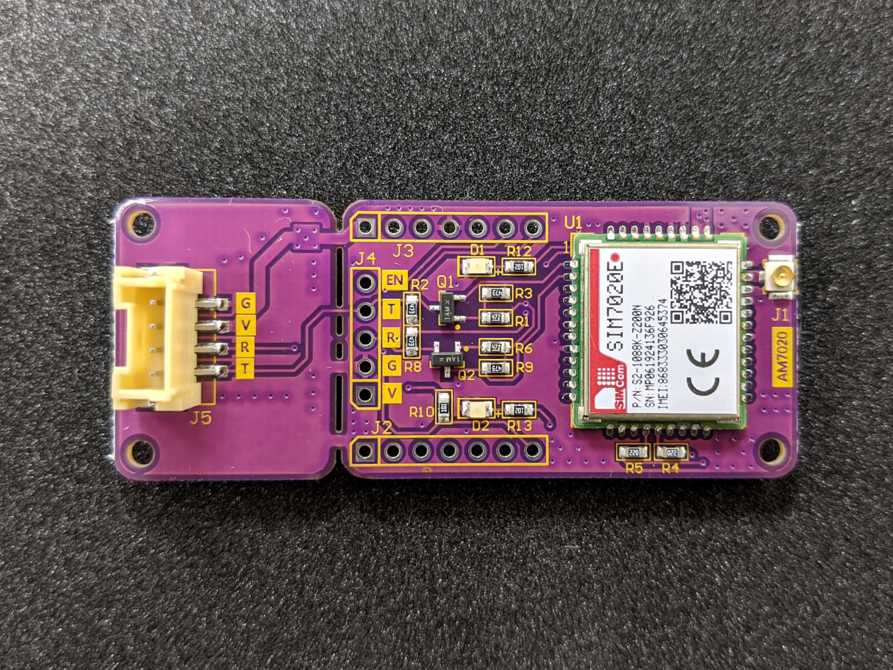

# AM7020 Arduino 範例程式碼
 [AM7020](https://atticedu.com/index.php/am7020.html) (SIMCOM SIM7020E) 窄頻物聯網(NBIoT)模組 Arduino 範例程式碼
 
  
 
 ## 相依函式庫 dependent libraries
 * [tinyGSM](https://github.com/FelixLinSY/TinyGSM) (/w SIM7020 patch)
 * [ArduinoHttpClinet](https://github.com/FelixLinSY/ArduinoHttpClient) (/w SIM7020 patch) for HTTP/HTTPS
 * [PubSubClient](https://github.com/knolleary/pubsubclient) for MQTT/MQTTS
 * [SSLClinet](https://github.com/OPEnSLab-OSU/SSLClient) for HTTPS/MQTTS
 
 為方便起見，也可以直接下載打包好的 [library 壓縮檔](http://bit.ly/am7020lib)，下載後直接解壓縮到 Arduino/libraries 目錄下即可。
 
 
 ## 通訊協定與開發板支援表
 
 | Boards | HTTP | HTTPS | MQTT | MQTTS |
| ------           | ------ | ------ |------ | ------ |
| Arduino UNO/Nano | supported |            | supported |  |
| Arduino Mega     | supported |            | supported |           |
| ESP32             | supported | supported | supported | supported |
| Arduino MKR Series | supported | supported | supported | supported | 

 ## 教學說明
  待新增

# AM7020 Arduino 
 AM7020 (SIMCOM SIM7020E) NBIoT module example code for Arduino
 
   
 ## dependent libraries
 * [tinyGSM](https://github.com/FelixLinSY/TinyGSM) (/w SIM7020 patch)
 * [ArduinoHttpClinet](https://github.com/FelixLinSY/ArduinoHttpClient) (/w SIM7020 patch) for HTTP/HTTPS
 * [PubSubClient](https://github.com/knolleary/pubsubclient) for MQTT/MQTTS
 * [SSLClinet](https://github.com/OPEnSLab-OSU/SSLClient) for HTTPS/MQTTS
 
 ## Supported protocol for Arduino boards
 
 | Boards | HTTP | HTTPS | MQTT | MQTTS |
| ------           | ------ | ------ |------ | ------ |
| Arduino UNO/Nano | supported |            | supported |  |
| Arduino Mega     | supported |            | supported |           |
| ESP32             | supported | supported | supported | supported |
| Arduino MKR Series | supported | supported | supported | supported |
 
## Tutorial 
 TBD
 
